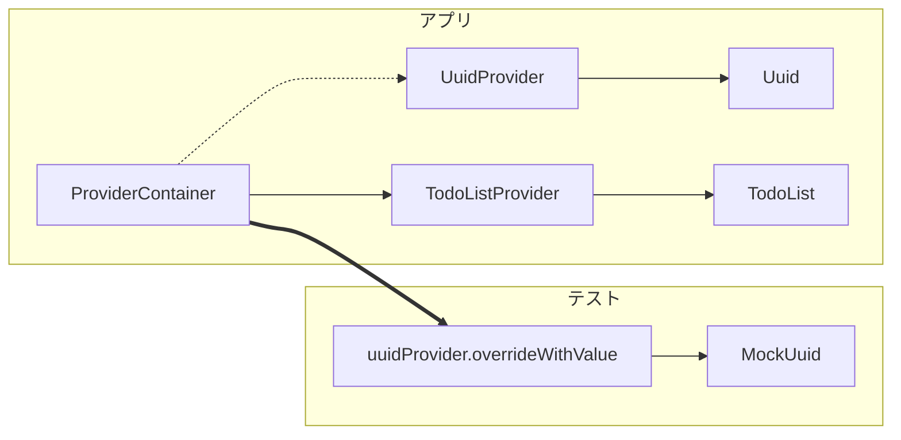

## プロジェクトの準備

Zappにある Todoアプリ <https://zapp.run/edit/riverpod-todo-app-z02c06r102d0>
もしくは example/todos <https://github.com/rrousselGit/riverpod/tree/master/examples/todos>

testフォルダには、Widgetテストを行うテストがすでに用意されています。
ProviderをテストするUnitTestはないので、これを追加していきます。

## データのテストで肩慣らし

Providerを使ったテストの前に、単純なUnitTestを追加してみましょう。
Todoクラスが等しいかチェックするテストを追加します。
Todoクラスのパラメータが一致していれば、等しいと判断されるはずです。

```dart
import 'package:flutter_test/flutter_test.dart';
import 'package:todos/todo.dart';

void main() {
  test('同じ引数のToDoクラスは等しい', () {
    final todo1 = Todo(id: '1', description: 'shopping');
    final todo2 = Todo(id: '1', description: 'shopping');

    expect(todo1 == todo2, isTrue);
  });
}
```

テストを追加して、実行してみましょう。

```bash
Expected: true
  Actual: <false>

package:matcher                                     expect
package:flutter_test/src/widget_tester.dart 480:18  expect
test/todo_test.dart 9:5                             main.<fn>
```

おっと、テストが失敗してしまいました。
Todoクラスの定義を見ると、==演算子がオーバーライドされていません。
==実装は手間なので、freezedパッケージを追加して簡単に実装します。

```bash
dart pub add freezed_annotation
dart pub add dev:freezed
```

`todo_data.dart`ファイルを作成し、Todoクラスをfreezedで定義します。

```dart
import 'package:freezed_annotation/freezed_annotation.dart';

part 'todo_data.freezed.dart';

@freezed
class Todo with _$Todo {
  const factory Todo({
    required String description,
    required String id,
    @Default(false) bool completed,
  }) = _TodoData;
}
```

`flutter pub run build_runner build`で生成し、参照しているインポートを置き換えましょう。
ここまでできたら、もう一度テストを実行してみましょう。

```bash
✓ 同じ引数のToDoクラスは等しい

Exited.
```

成功しました :tada:
テストの書き方の基本が分かったところで、Providerを使ったテストを追加しましょう。

## Expect

それでは、すでに実装があるTodoListNotifierをテストします。
簡単のため、Todoを追加できるテストを1つだけ追加します。

### Todoを追加するテスト

では、追加できるテストを追加しましょう。

```dart
  group(TodoList, () {
    test('Todoを追加できる', () {
      // ProviderScopeの代わりにProviderContainerを作成
      final container = ProviderContainer();
      // TodoListNotifierがdisposeされないように
      final subscription = container.listen(todoListProvider, (_, __) {});
      // TodoListNotifierを取得
      final todoList = container.read(todoListProvider.notifier);

      todoList.add('buy');

      expect(subscription.read().last, Todo(description: 'buy', id: '1'));
    });
  });
```

このテストはRiverpodのテストの書き方を参考にしています。
<https://riverpod.dev/docs/essentials/testing>

テストを実行してみましょう。
IDが一致せず失敗してしまいました。

```bash
Expected: _$TodoDataImpl:<Todo(description: buy, id: 1, completed: false)>
  Actual: _$TodoDataImpl:<Todo(description: buy, id: 4cb80956-05c7-436f-a916-dde353e7a678, completed: false)>

package:matcher                                     expect
package:flutter_test/src/widget_tester.dart 480:18  expect
test/todo_test.dart 32:7                            main.<fn>.<fn>
```

実装を見てみると、IDはUUIDパッケージによって生成されています。
ここをモックできるよう、ProviderでDIするように変更します。

### UUIDのモック

モックのために、mocktailパッケージを追加します。

```bash
flutter pub add mocktail
```

`uuidProvider`を追加し、addメソッドではRiverpod経由でUUIDを取得するように変更します。

```todo.dart
final uuidProvider = Provider((_) => Uuid());
```

```todo.dart
void add(String description) {
    state = [
      ...state,
      Todo(
        // 変更: riverpod経由でUUIDを取得
        id: ref.read(uuidProvider).v4(),
        description: description,
      ),
    ];
  }
```

これでUUIDをモックする準備が整いました。
テストコードを以下のように変更します。

```dart
// UUIDのモッククラス
class _MockUuid extends Mock implements Uuid {}

void main() {
  ...
  group(TodoList, () {
    test('Todoを追加できる', () {
      // --- 変更 ---
      final uuid = _MockUuid();
      final container = ProviderContainer(overrides: [
        uuidProvider.overrideWithValue(uuid),
      ]);
      when(() => uuid.v4()).thenReturn('1');
      // --- 変更 ---
...
      expect(subscription.read().last, Todo(description: 'buy', id: '1'));
    });
  });
}
```

テストを実行してみましょう。

```bash
✓ TodoList Todoを追加できる

Exited.
```

成功しました! :tada: :tada:

ここで、TodoListはUuidに依存しています。
テストでは、ProviderContainerによってUuidをモックに差し替えています。



### AAAパターン

作成したテストをもう一度見てみましょう。
3つのパートに分けてテストを記述しています。

```dart
  group(TodoList, () {
    test('Todoを追加できる', () {
      // Arrange
      final uuid = MockUuid();
      final container = ProviderContainer(overrides: [
        uuidProvider.overrideWithValue(uuid),
      ]);
      when(() => uuid.v4()).thenReturn('1');
      final subscription = container.listen(todoListProvider, (_, __) {});
      final todoList = container.read(todoListProvider.notifier);

      // Act
      todoList.add('buy');

      // Assert
      expect(subscription.read().last, Todo(description: 'buy', id: '1'));
    });
  });
```

Arrange-Act-Assertに分けてテストを書くことをAAAパターンと呼びます。
AAAパターンに従うことで、テストの可読性が向上し、テストの目的が明確になります。

## Verify

`expect`は、テストの結果を直接検証していました。
`expect`で直接検証することが望ましいですが、間接的に検証することが必要なこともあります。
テストの結果を間接的に検証する方法として、`verify`があります。

FirebaseEventのようなイベントトラッカーを追加して、テストの追加イベントが発生することを検証してみましょう。
簡単にするため、ダミーのイベントを発生させるクラスにします。

新しい実装なのでテストファーストで書いてみましょう。
'Todoを追加する'テストに追記します。

※この時点では`EvenTracker`がないのでコンパイルエラーになります。

```dart
    test('Todoを追加できる', () {
      final uuid = _MockUuid();
      final eventTracker = _MockEventTracker(); // 追加
      final container = ProviderContainer(overrides: [
        uuidProvider.overrideWithValue(uuid),
        eventTrackerProvider.overrideWithValue(eventTracker), // 追加
      ]);
      when(() => uuid.v4()).thenReturn('1');
      final subscription = container.listen(todoListProvider, (_, __) {});
      final todoList = container.read(todoListProvider.notifier);

      todoList.add('buy');

      expect(subscription.read().last, Todo(description: 'buy', id: '1'));
      verify(() => eventTracker.trackAddTodo('buy')).called(1); // 追加
    });
...

class _MockEventTracker extends Mock implements EventTracker {} // 追加
```

コンパイルエラーを解消しましょう。
eventTrackerProviderを追加して、EventTrackerを追加します。

```dart
import 'package:flutter/foundation.dart';
import 'package:hooks_riverpod/hooks_riverpod.dart';

final eventTrackerProvider = Provider((_) => EventTracker());

class EventTracker {
  void trackAddTodo(String description) {
    debugPrint('trackAddTodo: $description');
  }
}
```

テストからインポートを追加します。
これでコンパイルが通りました。テストを実行してみましょう。

```bash
No matching calls (actually, no calls at all).
(If you called `verify(...).called(0);`, please instead use `verifyNever(...);`.)
package:matcher                            fail
package:mocktail/src/mocktail.dart 728:7   _VerifyCall._checkWith
package:mocktail/src/mocktail.dart 519:18  _makeVerify.<fn>
test/todo_test.dart 33:13                  main.<fn>.<fn>
```

テストが失敗しました。
`trackAddTodo`メソッドが呼ばれていないと出力されています。
`add`メソッドから呼んでいないので当たり前ですね。

`add`メソッドから`trackAddTodo`メソッドを呼ぶよう変更しましょう。

```dart
  void add(String description) {
    state = [
      ...state,
      Todo(
        id: ref.read(uuidProvider).v4(),
        description: description,
      ),
    ];
    ref.read(eventTrackerProvider).trackAddTodo(description); // 追加
  }
```

これでテストを実行してみましょう。

```bash
✓ 同じ引数のToDoクラスは等しい
✓ TodoList Todoを追加できる

Exited.
```

成功しました! :tada: :tada: :tada:
このように、呼ばれていることだけを検証したい場合は`verify`を使います。

## API通信

TodoListNotifierにAPI通信を追加して、API通信のテストを追加します。
ここではAPI通信の代わりに、Repository層で抽象化したものを使います。

まず、Repository層を追加します。

```repository.dart
import 'package:hooks_riverpod/hooks_riverpod.dart';
import 'package:todos/todo_data.dart';

final todoRepositoryProvider = Provider((_) => TodoRepository());

class TodoRepository {
  Future<List<Todo>> fetch() {
    return Future.value([]);
  }
}
```

初期状態をAPIから取得し、API通信が成功したことを検証するテストを追加します。

```dart
  group(TodoList, () {
    // 追加: 新しいテスト
    test('初期状態をAPIから取得できる', () async {
      final todoRepository = _MockTodoRepository();
      final container = ProviderContainer(overrides: [
        todoRepositoryProvider.overrideWithValue(todoRepository),
      ]);
      when(() => todoRepository.fetch()).thenAnswer((_) => Future.value([Todo(id: '1', description: 'shopping')]));
      final subscription = container.listen(todoListProvider, (_, __) {});
      final todoList = container.read(todoListProvider.notifier);

      await todoList.fetch();

      expect(subscription.read(), [Todo(id: '1', description: 'shopping')]);
    });
  });

class _MockTodoRepository extends Mock implements TodoRepository {}
```

`fetch`メソッドを追加します。

```dart
  Future<void> fetch() async {
    state = await ref.read(todoRepositoryProvider).fetch();
  }
```

テストを実行してみましょう。

```bash
✓ 同じ引数のToDoクラスは等しい
✓ TodoList 初期状態をAPIから取得できる
✓ TodoList Todoを追加できる

Exited.
```

成功しました! :tada: :tada: :tada:

## まとめ

- AAAパターンを使ってテストを書く
- `expect`で直接結果を検証する
- `verify`で間接的な結果を検証する
